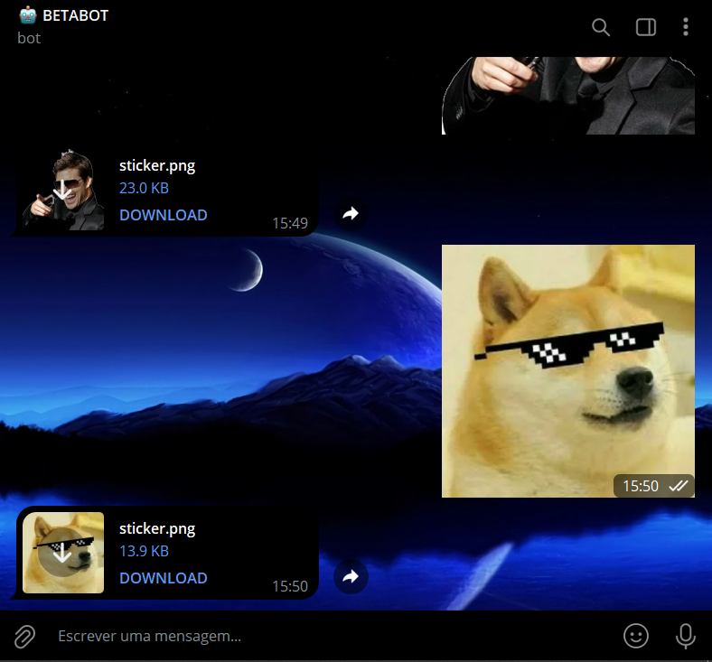

# STICKERS ESTATICOS PARA PNG
🛑ESSE É UM BOT DO TELEGRAM QUE CONVERTE STICKERS ESTATICOS PARA PNG!

 <br>

## DESCRIÇÃO:
Este bot do Telegram foi projetado para lidar com stickers estáticos enviados pelos usuários. Aqui estão os principais recursos:

1. **Envio de Instruções**: Quando o usuário enviar o comando "/start", o bot responde fornecendo instruções sobre como interagir com ele.

2. **Processamento de Stickers Estáticos**: Quando o usuário enviar um sticker estático, o bot baixa o sticker, converte-o para o formato PNG e envia de volta ao usuário.

3. **Tratamento de Erros**: O bot é projetado para lidar com possíveis erros durante o processamento dos stickers, fornecendo feedback ao administrador do bot caso ocorra algum problema.

4. **Remoção de Arquivos Locais**: Após enviar o sticker convertido, o bot remove o arquivo temporário localmente para economizar espaço e garantir a limpeza.

## PROCEDIMENTO DE COMPRA:
- O valor deste bot é de R$ 100,00.
- Para efetuar a compra, por favor, entre em contato comigo por mensagem privada, informando:
    ```bash
    Gostaria de adquirir o bot: https://github.com/VILHALVA/STICKERS-ESTATICOS-PARA-PNG
    ```
- Após a confirmação do pagamento e o envio do comprovante, você receberá um arquivo zip contendo o código-fonte do bot, acompanhado de um manual detalhado (`MANUAL.md`), que oferece instruções abrangentes sobre a configuração do ambiente, sugestões de cursos e documentação recomendada, bem como o arquivo `HOSPEDAGEM.md`, contendo orientações para hospedar o seu bot.
- Caso deseje serviços adicionais, como configuração do bot ou teste VIP, será aplicada uma taxa adicional de R$ 100,00 ao custo do bot.
- Se optar por adicionar mais recursos ou funcionalidades ao projeto, será aplicada uma taxa adicional de R$ 200,00 para cada novo recurso ou funcionalidade.
- [🤑CLIQUE AQUI PARA ENTRAR EM CONTATO](https://t.me/VILHALVA100)
- [🧑‍💻PRECISA DE UM FREELANCER? CLIQUE AQUI PARA VER EM TELEGRAPH](https://telegra.ph/FREELANCER-10-19-9)
- [🧑‍💻PRECISA DE UM FREELANCER? CLIQUE AQUI PARA VER EM README](https://github.com/VILHALVA/VILHALVA/blob/main/FREELANCER/README.md)

